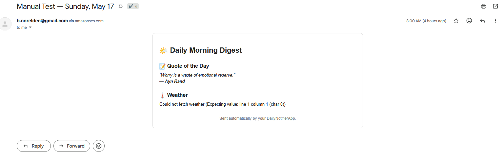
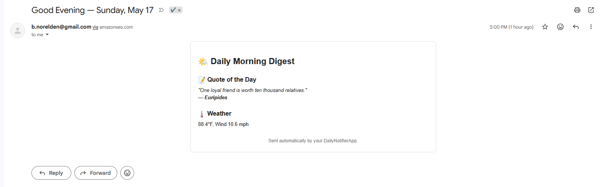
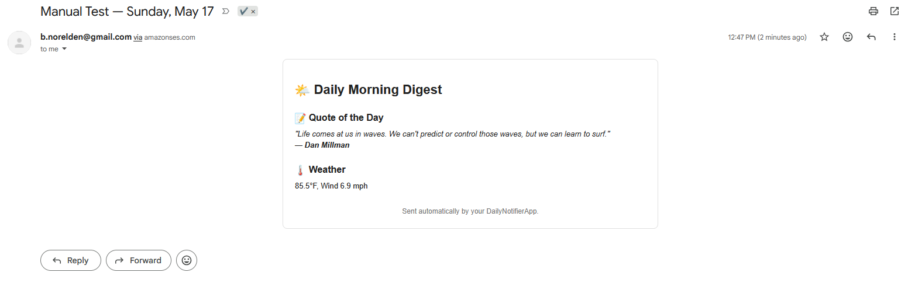
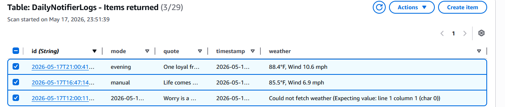
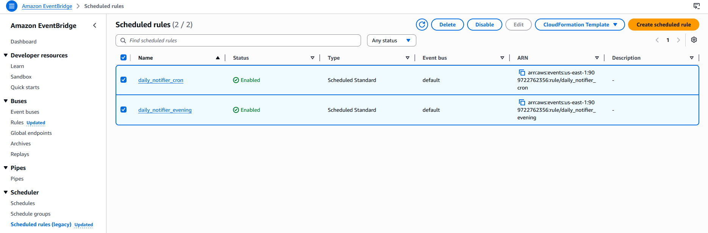

DailyNotifierApp — Automated Morning & Evening Email Digest
A serverless AWS application that sends automated morning and evening digest emails containing:

A motivational quote

Local weather

A clean HTML template

Logged entries in DynamoDB

All infrastructure is deployed using Terraform, and all automation is handled by AWS Lambda + EventBridge + SES + DynamoDB.

🚀 Features
Scheduled emails (8 AM & 5 PM) via EventBridge

HTML email template rendered by Lambda

Weather + Quote APIs

DynamoDB logging for every run

SES email delivery

Terraform IaC for full reproducibility

Manual test mode for debugging

🧱 Architecture Overview
EventBridge triggers Lambda twice daily

Lambda fetches weather + quote, renders HTML, sends via SES

DynamoDB stores each run (timestamp, mode, quote, weather)

SES handles outbound email

Terraform provisions all resources

📸 Screenshots
All screenshots are stored in /screenshots.

### **Morning Email**

### **Evening Email**

### **Manual Test Email**

### **DynamoDB Entry**

### **EventBridge Rules**

🛠️ Tech Stack
AWS Lambda (Python 3.12)

AWS EventBridge Scheduler

AWS SES

AWS DynamoDB

Terraform

Python Requests

📦 Deployment (Terraform)
Update variables in variables.tf

Zip Lambda code:

Code
zip lambda.zip notifier.py
Deploy:

Code
terraform init
terraform apply
🧪 Testing
Trigger Lambda manually with:

json
{ "time": "manual" }
Morning simulation:

json
{ "time": "morning" }
Evening simulation:

json
{ "time": "evening" }
📚 DynamoDB Schema
Each entry contains:

id — timestamp

mode — morning / evening / manual

quote

weather

timestamp

🔧 Future Enhancements
add retry logic

exit SES sandbox

add DynamoDB TTL expiration

add cleanup Lambda

Additional APIs (news, reminders, etc.)

📄 License
MIT License.
